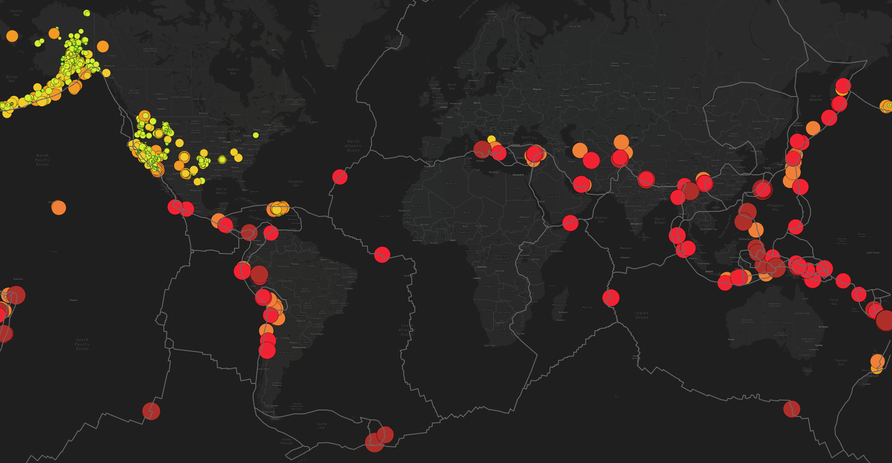

# Mapping Earthquakes - Module 14 Challenge
UNC Chapel Hill Data Analytics Bootcamp

## Overview of Project
For Module 14, HTML, JavaScript, Leaflet, and Mapbox were used to create an interactive map of recent earthquakes. The webpage has three map styles - street view, satellite view, and dark mode - and three layers - tectonic plate lines, all earthquakes, and major earthquakes only. Users can switch between map styles and select which layers they want to be visible. Tectonic plate data is from [this GitHub repository](https://github.com/fraxen/tectonicplates). Earthquake data is from [this GeoJSON](https://earthquake.usgs.gov/earthquakes/feed/v1.0/summary/all_week.geojson) and [this GeoJSON](https://earthquake.usgs.gov/earthquakes/feed/v1.0/summary/4.5_week.geojson), both of which are from the United States Geological Survey (USGS). Please note that displaying everything correctly requires a Mapbox API key.

## Method & Results
### Part 1 - Creating A Map To Show Earthquake And Tectonic Plate Data
Tile layers were set for street and satellite view Using JavaScript in conjunction with Leaflet and Mapbox (access requires an API key). Both maps were added to layer groups, which were then added to an overlay object. Connecting those to a map control is what allows users to select which map style they want as their background.

Click me to see the available layers.

Click me to see the satellite map.

Using d3, the [borders of tectonic plates](https://raw.githubusercontent.com/fraxen/tectonicplates/master/GeoJSON/PB2002_boundaries.json) were loaded, styled, and added to a GeoJSON layer. While users can only select one map style, they can keep or remove any layers they wish.

Click me to see the map with tectonic plate lines.

The GeoJSON data containing all earthquakes from the past seven days was then loaded. Magnitude ranges were set to different colors, with red meaning a higher magnitude. Another function set the radius of each earthquake to draw users' attention to more significant earthquakes. These values were then loaded into a GeoJSON layer of circle markers. Users can click a circle to see the chosen earthquake's magnitude and location.

Click me to see the map with all earthquakes from the past seven days (at the time of writing).

### Part 2 - Adding Major Earthquake Data
To allow users to only view earthquakes with magnitudes ≥4.5, another map layer was added. Following the same process as the "All Earthquakes" layer, the GeoJSON data was loaded, styled, and added to a layer. Users can click a circle to see the chosen earthquake's magnitude and location.

Click me to see the map with major earthquakes from the past seven days (at the time of writing).

### Part 3 - Adding Another Map Style
Another map style was added, giving users the option of dark mode, to demonstrate proficiency in the topic.

Click me to see the dark mode map.

